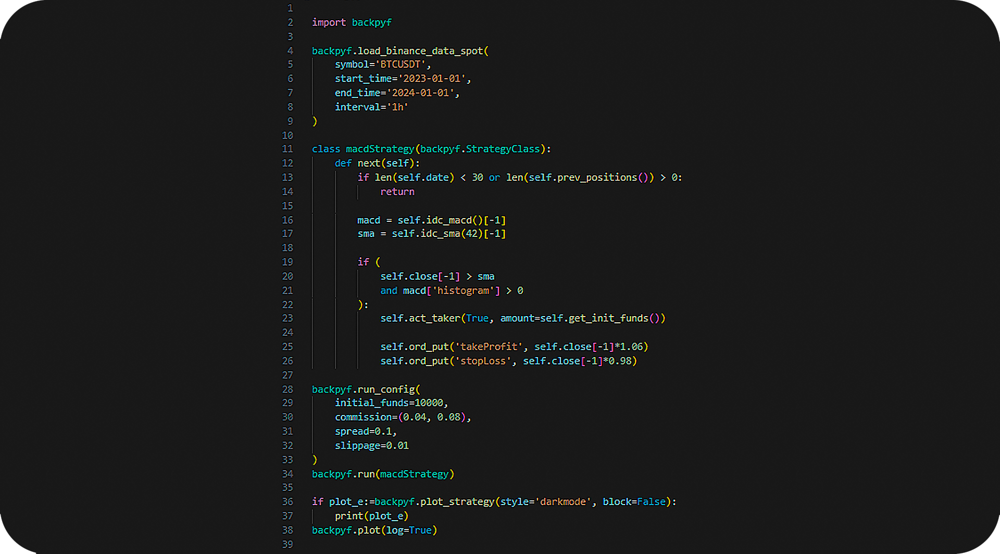
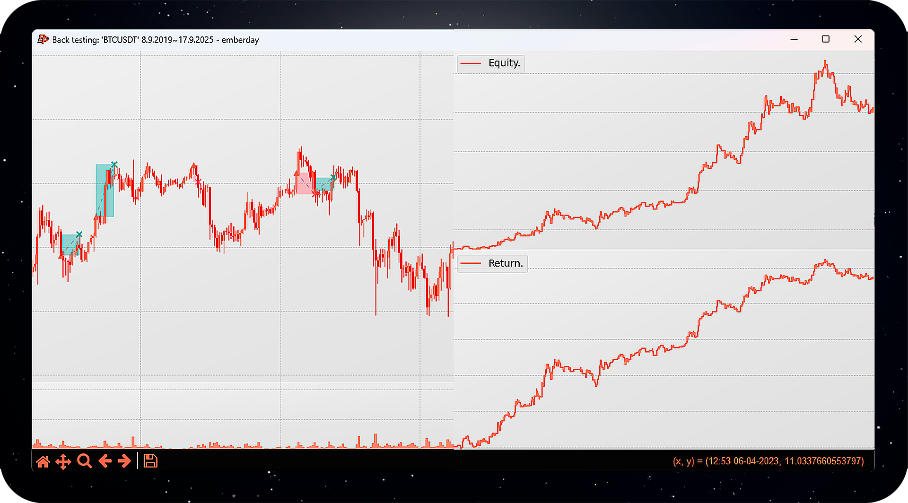

 

# BackPy

**BackPy** is a Python library for backtesting strategies in financial markets.
You can provide your own historical data or use the built-in integration with the `yfinance` or `binance-connector` modules.

With **BackPy-binance-connector** you can connect your strategy to the real market using Binance.
Official repository: https://github.com/diego-cores/BackPy-binance-connector.

## ⚠️ Important Notices

Please make sure to read the following before using this software:

- [Risk Notice](Risk_notice.txt)
- [License](LICENSE)

By using this software, you acknowledge that you have read and agree to the terms outlined in these documents.

## 📦 How to install backpy with pip

1. Download the latest version from GitHub

- Go to this project GitHub page.
- Download the ZIP file of the latest version of the project.

2. Unzip the ZIP file

- Unzip the ZIP file you downloaded.
- This will give you a folder containing the project files.

3. Open the terminal

- Open the terminal in your operating system.
- Navigate to the folder you just unzipped. You can use the cd command to change directories.

4. Install the module

- Once you are in the project folder in terminal, run the following command: `pip install .`.
- This command will install the Python module using the setup.py file located in the project folder.

5. Verify installation

- After the installation process finishes without errors, you can verify if the module has been installed correctly by running some code that imports the newly installed module.

6. Clean downloaded files

- After you have verified that the module is working correctly, you can delete the downloaded ZIP file and unzipped folder if you wish.

## 🚀 Code example

With Backpy, you can design your strategies quickly, easily, and in just a few lines.

Don't forget to create a chart!

Draw a chart and visualize the results of your strategy. For example, your profit equity chart or whatever you like.

With BackPy you can customize as much as you want.
